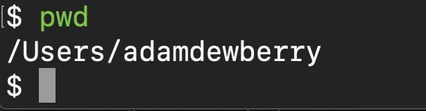
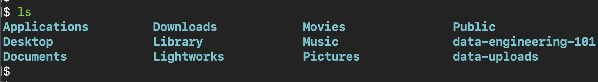
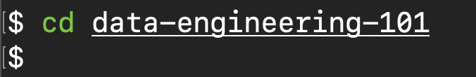
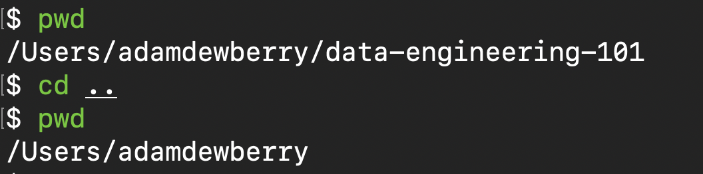
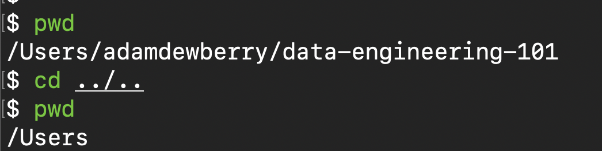
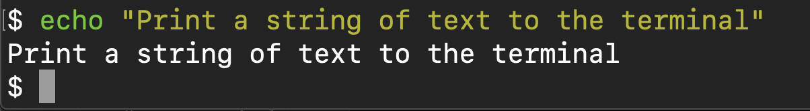
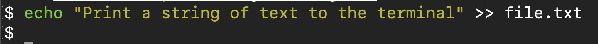

# Navigating a file system

Open your terminal or git BASH (if you are using a Windows machine).

Note: ensure you are using git BASH and not the Windows command prompt, some of these commands will differ and we're aiming for consistent ways of working across many operating systems.

### git Bash

As mentioned in the [intro to unix and gitbash](intro-to-unix-and-gitbash.md), git BASH is a BASH emulator, we use this to interact with the Windows OS using a UNIX-like shell with Bash commands.

## Commands and flags
You can use commands to interact with the file system, for example to change directory, copy files and many other useful tasks.

When using a command they often have optional parameters called flags. These flags pass additional context and information, one common example is `--help` which provides information on the application you're using.

## Common shell commands:

### Where am I?
Find out where you are using:

    pwd

The result returned tells me I'm in the directory `/Users/adamdewberry`

### List files and folders
List directory contents.  
Useful flags:
- `-l` list view
- `-a` show hidden (dot) files and folders

Invocation:

    ls -al

### Make a new directory

Invocation:

    mkdir data-engineering-101

### Change directory

Invocation:

    cd data-engineering-101

To go back a level in your directory tree:

    cd ..

Two levels

    cd ../..

### Printing to the terminal

Invocation:

    echo "Print a string of text to the terminal"

### Sending shell output to a file

In other words, creating a file and inserting the output from your command.

Invocation:

    echo "Print a string of text to the terminal" >> file.txt

## Remove files or directories

To delete a file or directory use the remove command.

Invocation:

    rm file.txt

To remove a directory and its contents you will need the flag `-r` which stands for recursive, to remove the files recursively (the directory and everything in it):

    mkdir dir-name/
    rm -r dir-name/
