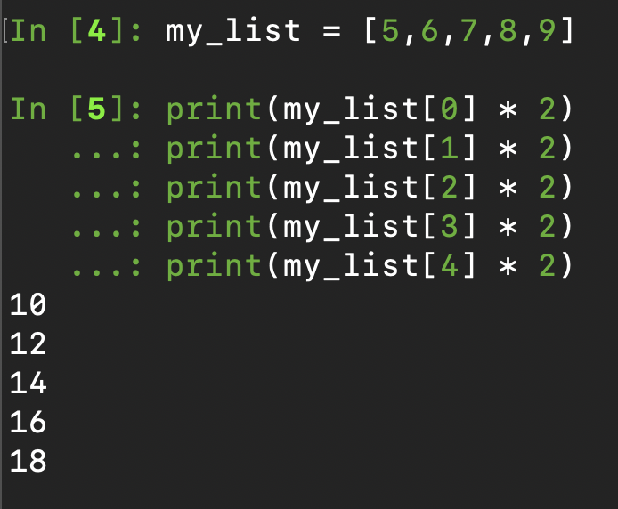
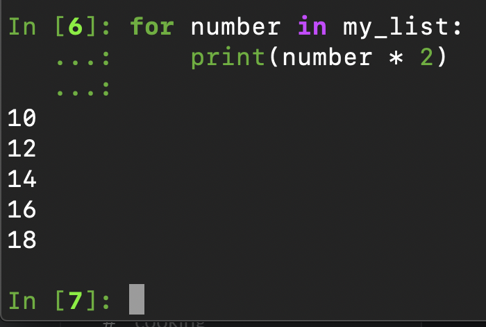
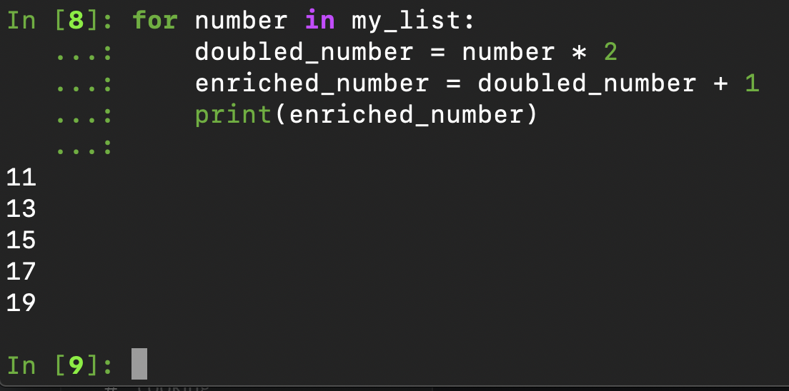
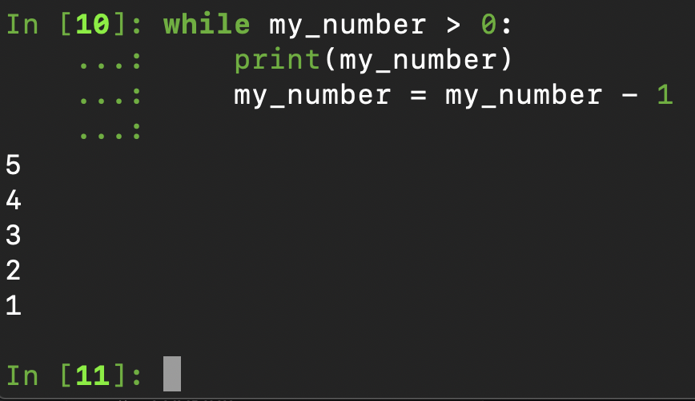
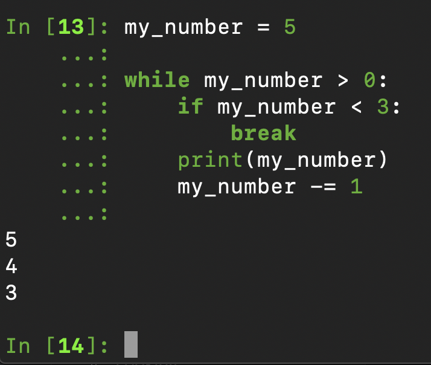
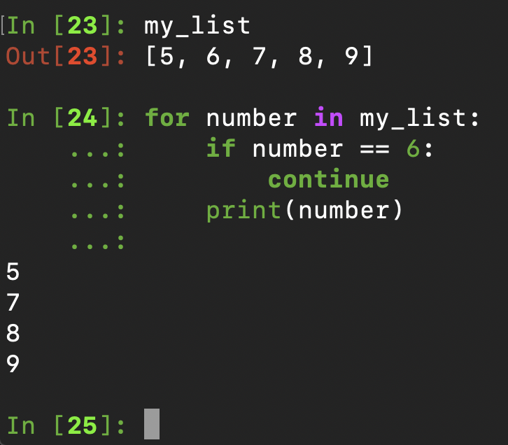

# Loops

## What?

Programming languages have an essential concept of looping, this repeats the same operation based on iterating through an object or continuing until a logical statement is satisfied.

Within Python there are `for` loops and `while` loops.

## Why?

If ever you're doing the same thing multiple times, you should ask yourself, could a loop do this for me?

## How?

### `for` loops

Create a list:

    my_list = [5,6,7,8,9]

Say we want to print each element and double it:

    print(my_list[0] * 2)
    print(my_list[1] * 2)
    print(my_list[2] * 2)
    print(my_list[3] * 2)
    print(my_list[4] * 2)

That seems like a waste of lines and what if `my_list` contained 100 numbers or 10,000 numbers, that's a lot repetition.

Instead, we can use:

    for number in my_list:
        print(number * 2)

Hazzar! We've used two lines of code to repeat the same process and 'loop' through the list.

The list is classed as an iterable and is an object able to be iterated over. This means taking each element one at a time and applying some logic to it, in this case `print(number * 2)`.

When using an a loop, we must assign the individual element which is being iterated over, for our example, `number` is the individual element that is passed on each cycle of the loop. You can name this however you please, but it is advised to name it something sensible that represents what the element is.

We can do multiple operations in a loop:

    for number in my_list:
        doubled_number = number * 2
        enriched_number = doubled_number + 1
        print(enriched_number)

### `while` loops

`while` loops continue to operate whilst a logical expression is satisfied.

Let's take the example of a number counting down.

    my_number = 5

    while my_number > 0:
        print(my_number)
        my_number = my_number - 1

This function takes the object my_number, prints it and then re-assigns it to its original value minus one.

So long as `my_number > 0`, the loop continues.

Whilst we're here, let's sprinkle some syntactic sugar on the above:

    my_number = 5

    while my_number > 0:
        print(my_number)
        my_number -= 1

This does the same operation of `my_number = my_number - 1` but uses a neat piece of Python syntax, often referred to as syntactic sugar, to simplify the command.

### break

We can use the `break` command to exit a loop; this is useful when combined with conditional logic.

    my_number = 5

    while my_number > 0:
        if my_number < 3:
            break
        print(my_number)
        my_number -= 1

Here we've added in a condition that when `my_number` drops below `3`, break the loop and exit.

### continue

We can use the `coninue` command to skip an iteration in a loop:

    for number in my_list:
        if number == 6:
            continue
        print(number)

We can see that the number `6` was not printed, when the conditional statement was satisfied, Python ran the `continue` command and skipped to the next iteration.
