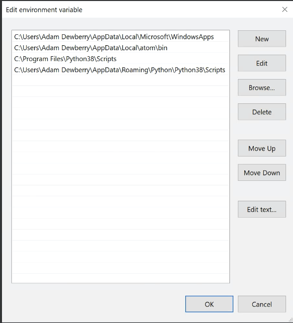

# Getting started

You'll need some software, I have tried to include everything you'll need for either a Windows or UNIX-like (Mac OS, Ubuntu etc) operating system.

## Python

Download a recent release of Python 3 from the [Python Foundation website](https://www.python.org/downloads/).

It's likely you'll have a modern OS so choose the x64 version, the 64 bit compatible version (in short it is more 'capable' than a 32 bit and can handle more data at once - there's no need to go deeper into the differences at this point).

## Visual Studio - Windows users
You may require Visual Studio and its compiler to install and run some Python libraries. Get it [here](
https://visualstudio.microsoft.com/visual-cpp-build-tools/)

## iPython

iPython is a Python interpreter, a place for you to run your code and practise. It has many useful additions built in over the top of Python - even things like colour-coded syntax highlighting which will improve your experience.
Once Python has been installed, open your command prompt or terminal.
- on Windows click the `Start / Windows` button, type cmd and select the `Command Prompt`.
- on Mac go to `Application` or use `command + space` then `terminal`.

to test your Python installation run `python --version`.

**Note:** tl;dr on Mac always use `python3 [commands]`.  
>  If you're using a Mac, there is likely a legacy version of Python already installed, `Python 2`; if you run `python --version` you'll see it's `2.7.x`. The version you have installed and we need is Python 3, to use that run `python3` instead of `python`.

To install iPython:

    pip install ipython

**Note:** for Windows users you'll need to configure an environment path, an attribute that when you run the command `ipython` points to the application.

1. click the Windows button.
1. type `environment` and click on `Edit the system environment variables`
1. At the bottom right of System Variables, select `Environment Variables`.

1. In your user environment variables, select `Path` and `Edit`.

1. Create a `New` variable with the path to your `iPython.exe` executable.  It is likely:
        C:\Users\<your user>\AppData\Roaming\Python\Python38\Scripts  
        C:\Program Files\Python38\Scripts

1. Close the terminal and open a new one, your paths should be updated. To test, run `ipython --version`.
