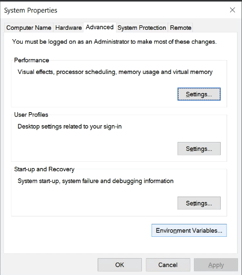
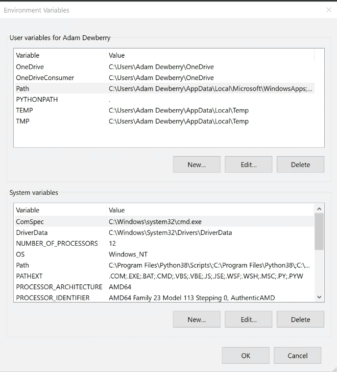

# Getting started - Downloading software

Firstly, you'll need some software. I have tried to include all of the instructions you'll need to install and run each software for either a Windows or UNIX-like (Mac OS, Ubuntu etc) operating system.

## Python

Download a recent release of Python 3 from the [Python Foundation website](https://www.python.org/downloads/), anything higher than `Python 3.8.0` will do.

It's likely you'll have a modern OS so choose the x64 version. The 64 bit compatible version, in short, is more 'capable' than a 32 bit and can handle more system data at once - there's no need to go deeper into the differences at this time.


During the installation, choose the custom install and select everything! There's a few parameters in there like 'adding Python to your path' that you'll need.

Once Python has been installed, open your command prompt or terminal:
- on Windows push `win + r` to get the run box and type `cmd` and enter to open a `Command Prompt`.
- on Mac go to `Application` or use `command + space` then `terminal`.

To test your Python installation run `python --version`.

**Note:** tl;dr on Mac always use `python3`.

>  If you're using a Mac, there is likely a legacy version of Python already installed, `Python 2`; if you run `python --version` you'll see it's `2.7.x`. The version you have installed, and we need, is Python 3, run `python3` instead of `python` every time.

### Visual Studio for Windows users
You may require Visual Studio and its compiler to install and run some Python libraries. Get it [here](
https://visualstudio.microsoft.com/visual-cpp-build-tools/)

## iPython

iPython is a Python interpreter, a place for you to run your code and practise. It has many useful additions built over the top of Python - including things like colour-coded syntax highlighting which will improve your development experience.

To install iPython, run the following in your terminal:

    pip install ipython

Pip is a package manager which helps us install useful things. [More on that here](python/pip-the-package-manager.md).

To test it installed, run:

    ipython --version

### Windows specific installation
**Note:** for Windows users you'll need to configure an environment path, an attribute that when you run the command `ipython` points to the application and opens it.

1. Click the Windows button.
1. Type `environment` and click on `Edit the system environment variables`.
1. At the bottom right of `System Variables`, select `Environment Variables`.

1. In your user environment variables, select `Path` and `Edit`.

1. Create a `New` variable with the path to your `iPython.exe` executable.  It is likely one or both of the following, make a new variable for each:
```
C:\Users\<your user>\AppData\Roaming\Python\Python38\Scripts  
C:\Program Files\Python38\Scripts
```

1. Confirm these through each window with `ok`. Close any terminals you have open and open a new one, your paths should be updated.
1. To test, run `ipython --version`.

## IDE - Integrated Development Environment

Now you have something to run the code, we need something where you can write it. An integrated development environment is such a place, this is software which provides a text editor and useful features to speed up your workflow.

`VS code` is an incredibly popular and free IDE which I'd recommend using to get started. There are plenty of others out there so if you prefer Atom, PyCharm, IntelliJ etc then go ahead and grab one of those. VS code is continually improving, reasonably feature complete and likely the same software your future colleagues will use.  [Get it here](https://code.visualstudio.com/download).

## git

git is used for version control, you can read more about that [here](git/101.md) but for now let's get it installed. [Download it here](https://git-scm.com/downloads).

Many of the config steps can be left as the defaults, however when asked to 'Choose the default editor', at this point select `VS Code` (or your other editor of choice), which we just installed.

These are reasonable instructions for [installing  git on windows](https://www.stanleyulili.com/git/how-to-install-git-bash-on-windows/).

### git BASH for windows

When installing git, git BASH should come bundled with it for Windows users. git BASH is a BASH emulator which will allow us to work in similar ways, with common commands to unix-like systems (Mac OS, Ubuntu etc) which use BASH. Our aim is to work with similar development and production patterns.

BASH is a UNIX command line interface where we can run things and configure the system. Mac OS and Linux machines have a terminal which can run BASH, though the commands are largely similar in their terminal.

Typically when putting code into production, this is done on servers which have a UNIX-like operating system and use BASH. Experienced developers also natively work on machines running a UNIX-like OS such as Ubuntu - for these reasons it's a good idea to work with similar tooling where everyone can run each other's code. Read about git BASH [here](https://gitforwindows.org/).
