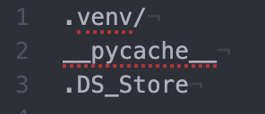

# .gitignore

## What

`.gitignore` is a file which lives in the root directory / top level of your project. Adding filenames and directories of a project to it prevents them from being committed and sent to the remote repository.

## Why

Some files which may be generated from your code, or libraries that are needed to run the code should not be committed as they are large and unnecessary to include in the project. Your README should include a list of any dependencies you need and a list of libraries should be provided; in the case of Python in a `requirement.txt` file.

## How

Create a file called `.gitignore`

First let's be sure one does't exist:

    ls -a

In bash:

    touch .gitignore

On Windows:

    copy con .gitignore

    ls -a

Now we have one, open it and start adding all of the files which you **do not** want to be commited. Examples may include your virtual environment directory, likely called `.venv`; you may also want to add in things like the `pycache`.

