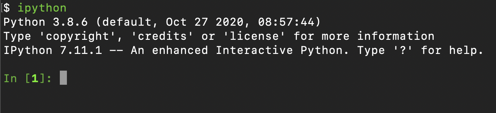
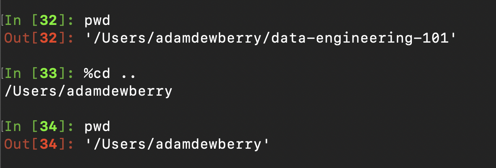
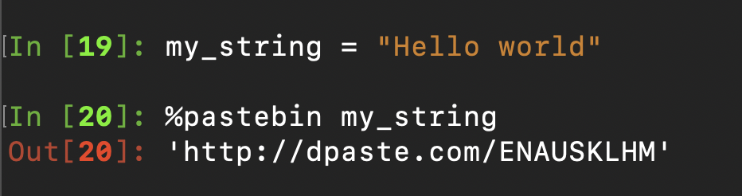
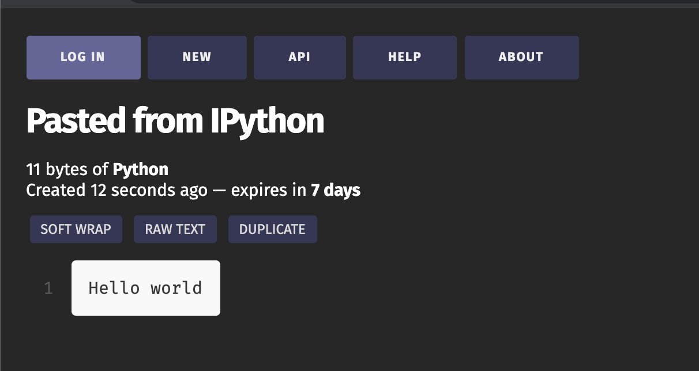
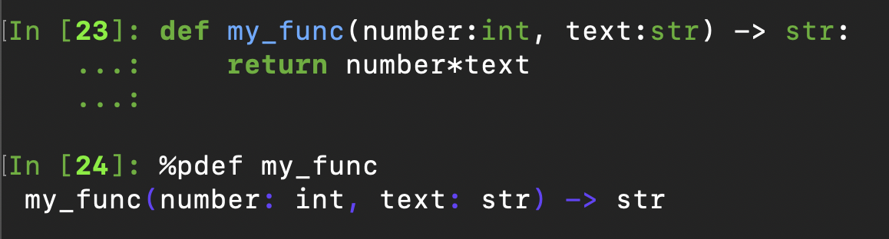
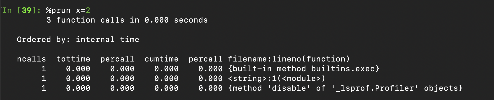
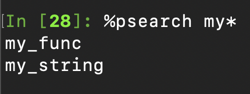

# iPython

## What?

IPython is a Python interpreter, an interactive shell which evaluates and runs Python code. You can run individual or multiple lines of code, this also includes evaluating whole files. IPython offers rich syntax highlighting, tab completion, history and introspection (examining the type or properties of an object) at runtime. The shell also accepts some common UNIX commands like `pwd` and `ls`.

## Why?

If Python is a language which uses an interpreter to process (interpret) code to 'do a thing' or return an output, we desire an interpreter which is also a friendly environment to develop in; IPython is a suped-up version of the Python interpreter and will do just that.
Whilst in an active shell, you can run commands on the fly and keep them in memory, allowing you to reference or manipulate them in future commands.

Evaluating a Python script processes all commands at runtime and clears out any variables and objects from memory created with the script which are no longer needed when the processing has completed; meaning once the code has finished running, nothing (unless explicitly outputted to the global system memory) will be stored as the session has closed, and we cannot retrieve objects used during the run.

IPython is a shell which remains open and so all global objects that the interpreter has access to remain in memory and we can call (retrieve) them. This is very useful to inspect objects and print them to the console. If you want to see the output of a function or break steps apart to debug, IPython is a useful environment to do this in.

## How?

Assuming you've already [set up IPython](../100/getting-started.md#ipython), open a terminal / git BASH and simply run the command:

    ipython

If you receive an error along the lines of

    command not found: ipython

Then you need to either install IPython or add it to your system environment path, you can find the [Windows instructions here](../100/getting-started.md#windows-specific-installation), it's unlikely a UNIX system (MacOS, Linux etc) will have this issue.

From here you have access to all of the usual Python commands.

## [_magic_ commands](https://ipython.readthedocs.io/en/stable/interactive/magics.html)

IPython's inbuilt magic commands are incredibly useful, this is not a complete list but some of the ones I find most helpful.

### `%magic`
Give information on magic commands available.

### `%lsmagic`

List all magic commands

### `%run`

In my workflow, the most commonly used magic command is %run, to run a Python script.

There are different optional flags which give additional information, like `-t` to show the time taken to execute or `-p` to use the profiler.

    %run myfile.py

    %run -t myfile.py

### `%cd`

Change directory

    %cd your/new/path

### `%dhist`

Which prints the visited directories during this IPython shell session.

### `%edit`

Opens a text editor to quickly navigate and write multi-line commands. Beware, you may not get on with this at first and is essentially Vim, vim is a key-stroke only text editor, no amount of clicks will get you out!

### `%env`

Prints the environment variables from the current shell.

### `%history`

Show the history of commands executed

### `%pastebin`

Copies a string or macro to pastebin and automatically generates a link for you to send to someone; very useful for sharing snipits of code.

### `%pdef` func  

Print the call signature for any callable object.

    %pdef object

    def my_func(number:int, text:str) -> str:
        return number*text

    %pdef my_func

### `%pip`

    %pip install package-name

### `%prun`

Run a statement through the python code profiler.

### `%psearch`

Search the namespace for an object based on given input. Putting an `*` wildcard before or after the string will find all object containing that phrase, e.g.

    %psearch my*

Will find all objects begining with my.

    %psearch *y_*

Will find any objects containing `y_`

    %psearch func*

Will find object ending in `func`

### `%reset`

Clears all objects in memory

### `%sx / !`

Allows the running of shell commands in the terminal

    !git status
    %sx git status

### `%time`
Time execution of a Python statement or expression.

### `%timeit`
Time execution of a Python statement or expression over a number of runs with an number of loops to find the average run time. There are many optional parameters and I suggest you [look up the docs](https://ipython.readthedocs.io/en/stable/interactive/magics.html#magic-timeit).
