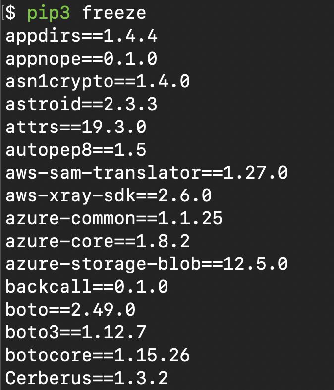
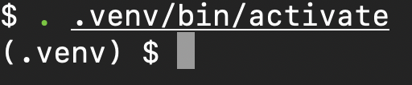
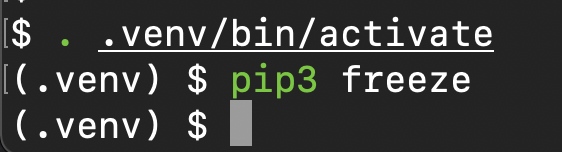
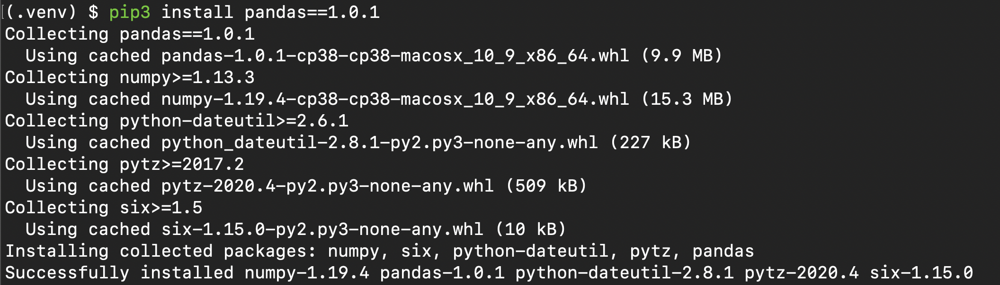
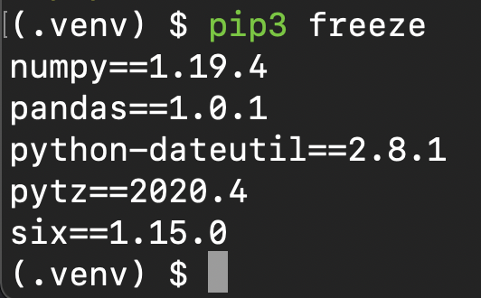
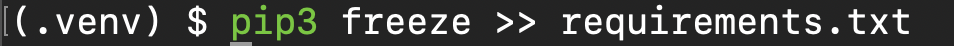
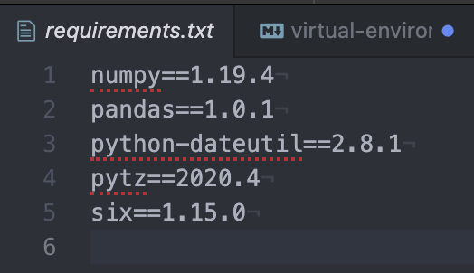
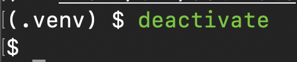

# Virtual Environments

If you haven't already, I'd strongly recommend reading the page on [pip the package manager](./pip-the-package-manager.md) before continuing.

## What?

A virtual environment is an isolated environment where you can install specific versions of libraries and software.

Check the [docs here](https://docs.python.org/3/tutorial/venv.html).

## Why?

Different projects and code bases may use different versions of libraries and packages, to ensure that you and others can consistently run a piece of code, you should use the same version of a library. Over time functions/methods and classes may be deprecated  and eventually stop being supported, or may be modified to the point which breaks your code. To avoid this, we 'pin' the version and consistently use that particular version, until we're ready to upgrade. It is important to upgrade libraries over time to receive security updates and extend functionality; no system is completely and even the compatibility with the hardware changes when enough time passes.

See the note on [semantic versioning](./pip-the-package-manager.md#a-note-on-semver) to explain how versioning works.

## How?

### Download the virtualenv library

    pip install virtualenv

**Note:** Remember, Windows likely uses `pip`, Mac, Ubuntu and UNIX-like use `pip3`.

### Create a virtual environment

Before we start, we can list the global packages installed on your machine with:

    pip freeze

This is a small snapshot of all of my global packages. We can see each specific version of each package.

Now we're ready to create the fresh, isolated and empty environment:

    python -m venv .venv

You can call the virtual environment whatever you want, though a typical naming convention is `.venv`. Dot files and directories by default are hidden in your file explorer and a name like `.venv` should be obvious as to what it is.

**Note:** You should add this directory to your `.gitignore` file as we do not want to commit all of the library code, it would be huge!

For a refresher on `.gitignore`, see the [101 page](../git/gitignore.md).

Create a venv called `.venv`.

### Load / enter the venv

There is a distinct difference between entering the venv on Windows and Mac / UNIX-like systems.

For UNIX-like, Mac, Ubuntu etc:

    . .venv/bin/activate

The first dot says, "in my current directory", then "load the activate file which lives in `.venv/bin/`".

For Windows:

    .venv\Scripts\activate.bat

You will see `(.venv)` to the left of your cursor to indicate you're now in your virtual environment.

You can check no packages "exist" in the environment:

    pip3 freeze  

## Installing packages

To install a specific version of a package, use the structure:

`package-name==semantic-version`.

For example to install pandas at version 1.0.1:

    pip3 install pandas==1.0.1

This will also install the dependencies needed for this specific release of pandas. We can check the packages again with `pip freeze`.

## Requirements.txt

You can export the entire environment's package list with:

    pip freeze >> requirements.txt

The file will appear in current directory and look like this:

Include this file in the root directory of the project and then others can install it with:

    pip install --requirement requirements.txt

## All finished?
When you're finished and wish to leave the venv, run:

    deactivate

## Final notes

You can create as many virtual environments as you wish, though you should only need one per project.

Never commit the packages, remember to add `.venv` or whatever you've called it to the `.gitignore` file.
