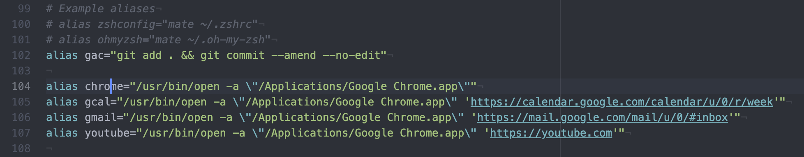

# Aliasing commands

You can "alias" commands to create shortcuts. If there is a popular set of commands or inputs you can create a alias which points to those commands and executes them, for example, I would like to alias opening the Google Chrome Browser.

    alias chrome="/usr/bin/open -a \"/Applications/Google Chrome.app\""

To open this website from the terminal, execute:

    chrome https://dewberry.dev/  

This alias will only be available in the current shell, to make them persist and available in future shell sessions they must be included in your shell's config file - for many Linux machines and older Mac OS, edit the `~/. bash_profile` and include the alias definition (as above) there. For Mac users and those with the ZSH shell, edit and include your aliases in `~/.zshrc`.

## git aliases

Sometimes I want to make a minor edit, add and commit all files without creating a new commit - I wish to edit the existing and retain the same commit message. Typically I would do the following:

    git add . && git commit --amend --no-edit

This looks like a perfect usecase to alias

    alias gac="git add . && git commit --amend --no-edit"
