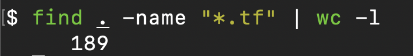

# Writing Documentation

## What

Documentation should tell you everything you need to run a project, it is the instruction manual. Should you join a project or hand one over to another maintainer, documentation can make or break a project.

## Why

If I gave you a project which used four programming languages, one of which has 189 files, where do you begin? That oddly specific example is a project I'm working on with five other developers right now, and that is a small project. Some "monolith" repositories (giant projects with all of the system code bundled together) can be in the thousands with tens or hundreds of thousands of lines of code.

For my example, they're mostly Terraform files, a configuration language to make infrastructure.

If someone joined this project:
- How would they know which software they need to run it?
- How do they contribute new code and maintain existing files?
- How is it deployed??

Good documentation should cover this.

## How

The logic for each answer in the above list is coved in the project's README. There is a [101 page on READMEs](./README.md), what they should contain and how to create one.

Where do you draw the line, what is worthy of documentation and what isn't?

I'll split it into three ares:

### Business logic

This should be covered in internal documentation that the organisation or department has access to; these are the processes and procedures and things like decision and risk logs. From a product perspective, this is where talking gets put on paper and the business requirements are defined.

### Contributing to and deploying code

As above, the README that lives with the code should contain all instructions to get it running and how to deploy it to production (the live system).

### The code itself

People can be divided on this, some opt for comments in the code, non-functional strings which give information about what the code does, how and why it does it; in Python these would be docstrings or in other languages, document comments.

I do not favour this approach and tend to write code as documentation. I wish my object names to be clear and obvious as to what they are. Each method / function should be small and do one job, and do it well. These functions should have appropriate names of `get_xxxxx`, `generate_yyyy`, `set_zzzz`. Examples like `get_credentials`, `copy_and_archive_file`, `create_s3_bucket` are perfectly fine and their input parameters will tell me what I need to give them.

I have no issue with a long method name if it is clear as to exactly what it does and I can instantly tell from reading it; I do not need comments as documentation to tell me.

I believe the disadvantage to writing documentation as comments in code is that they are rarely maintained, if the inputs and outputs change, if the functionality is altered over time; what is the source of truth? The code is. The code is the thing running and always live, by its nature that has to be true, so let's name things well and write clear, concise code that anyone can read.
